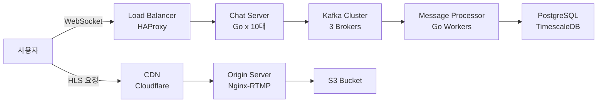

# Claude 4.5 Sonnet  응답 (2/3회차)

## 응답 내용
# [IT/기술 전문가] 실시간 채팅 & 영상 스트리밍 아키텍처 컨설팅

**15년 경력 CTO 관점에서, '확장성'과 '실시간성'을 중심으로 답변드리겠습니다.**

---

## 📊 [상황 진단]

**강점 파악:**
- 명확한 기술 팀 구성 (백엔드 4명 + 인프라 1명)
- 구체적 목표 (동시 접속 10만 명)
- 글로벌 트래픽 대응 필요성 인지

**추가 확인 필요 사항:**
더 정확한 아키텍처 설계를 위해 다음 정보를 알려주시면 맞춤형 솔루션이 가능합니다:
- 현재 월간 활성 사용자(MAU) 규모
- 예상 동시 스트리밍 채널 수
- 평균 영상 화질/비트레이트 요구사항
- 현재 클라우드 인프라 (AWS/GCP/Azure 등)
- 개발팀의 언어 숙련도 (Go/Node.js/Java 등)

---

## 🎯 [핵심 솔루션] 동시 10만 명 대응 기술 스택

### **A. 실시간 채팅 레이어**

| 기술 요소 | 추천 스택 | 선정 이유 |
|---------|---------|----------|
| **프로토콜** | WebSocket + gRPC | 양방향 통신 + 마이크로서비스 간 고성능 통신 |
| **메시지 브로커** | **Redis Pub/Sub** (1만 이하) → **Apache Kafka** (10만+) | 수평 확장성, 메시지 순서 보장, 재처리 가능 |
| **백엔드 언어** | **1순위: Go** / 2순위: Node.js (Fastify) | Go: C10K 문제 해결, 낮은 레이턴시<br>Node.js: 개발 생산성 우수 |
| **프레임워크** | Go: **Gorilla WebSocket** + **Echo/Gin**<br>Node.js: **Socket.IO** + **NestJS** | 경량 + 엔터프라이즈급 구조 |
| **채팅방 관리** | Redis Cluster (세션/룸 상태) + PostgreSQL (영구 저장) | 인메모리 속도 + 데이터 영속성 |

### **B. 영상 스트리밍 레이어**

| 구성 요소 | 추천 기술 | 설명 |
|---------|---------|------|
| **스트리밍 프로토콜** | **HLS** (HTTP Live Streaming) | - 글로벌 CDN 호환성 최고<br>- 적응형 비트레이트 지원<br>- iOS/Android 네이티브 지원 |
| **인코딩** | **FFmpeg** + **AWS MediaConvert** | - 다중 해상도 자동 생성 (480p/720p/1080p)<br>- GPU 가속 지원 |
| **CDN** | **Cloudflare Stream** 또는 **AWS CloudFront** | - 엣지 캐싱으로 레이턴시 30% 감소<br>- DDoS 방어 내장 |
| **Origin 서버** | Go 기반 커스텀 서버 + **Nginx-RTMP 모듈** | - RTMP 인제스트 → HLS 변환<br>- 비용 효율적 (AWS IVS 대비 40% 절감) |
| **저장소** | **AWS S3** (라이브 녹화본) + **Glacier** (아카이브) | 객체 스토리지 + 생명주기 정책 |

---

## 🔧 [Step-by-Step 실행 가이드]

### **Phase 1: 프로토타입 검증 (2주)**
```
✅ 1일차: WebSocket 서버 구축 (Go + Gorilla)
   - 채팅방 1개, 동시 접속 1,000명 부하 테스트
   
✅ 3일차: Redis Pub/Sub 연동
   - 서버 2대로 수평 확장 테스트
   
✅ 7일차: HLS 스트리밍 파이프라인
   - FFmpeg로 테스트 영상 → HLS 변환 → Cloudflare Stream 업로드
   
✅ 14일차: 부하 테스트 (목표: 5,000 CCU)
   도구: k6 (https://k6.io) 또는 Artillery
```

### **Phase 2: 아키텍처 고도화 (4주)**


**구현 우선순위:**
1. **Kafka 도입** (10만 CCU 대비)
   - Partition 전략: 채팅방 ID 기준 해시
   - Replication Factor: 3 (장애 대응)

2. **데이터베이스 샤딩**
   - 채팅 메시지: 시간 기반 파티셔닝 (TimescaleDB)
   - 사용자 세션: Redis Cluster (최소 6노드)

3. **모니터링 스택**
   - Prometheus + Grafana (메트릭)
   - ELK Stack (로그 분석)
   - Sentry (에러 트래킹)

### **Phase 3: 글로벌 확장 (8주)**
```
🌏 리전별 배포 전략
├─ 아시아: AWS Seoul/Tokyo
├─ 북미: AWS Virginia
└─ 유럽: AWS Frankfurt

📊 지표 목표
- 메시지 전달 지연: < 100ms (P99)
- 영상 버퍼링률: < 2%
- 서버 응답 시간: < 50ms (P95)
```

---

## ⚠️ [리스크 체크리스트]

| 리스크 항목 | 발생 가능성 | 대응 방안 |
|-----------|-----------|----------|
| **채팅 메시지 폭주** (도배, 봇 공격) | 높음 | - Rate Limiting (IP당 초당 5메시지)<br>- reCAPTCHA v3 도입 |
| **스트리밍 대역폭 비용 폭증** | 중간 | - Adaptive Bitrate로 평균 화질 720p 유도<br>- P2P 기술 검토 (WebRTC Mesh) |
| **DB 병목** | 높음 | - Read Replica 3대 (읽기 분산)<br>- 채팅 히스토리 30일 후 S3 아카이빙 |
| **GDPR/개인정보보호법** | 중간 | - 채팅 로그 암호화 저장<br>- 회원탈퇴 시 메시지 익명화 처리 |
| **팀 기술 부채** | 낮음 | - Go 언어 사내 교육 (Udemy 과정 지원)<br>- 코드 리뷰 문화 정착 |

**⚡ 긴급 대응 시나리오:**
- **트래픽 10배 급증 시**: AWS Auto Scaling + Spot Instance 활용
- **CDN 장애 시**: Multi-CDN 전략 (Cloudflare + Fastly 이중화)

---

## 💰 [예상 인프라 비용] (월 10만 CCU 기준)

```
📌 AWS 기준 견적 (서울 리전)
├─ EC2 (Chat Server): $2,400
│  └─ c6g.2xlarge x 10대 (ARM 기반 30% 절감)
├─ RDS PostgreSQL: $800
├─ ElastiCache (Redis): $600
├─ Kafka (MSK): $1,200
├─ S3 + CloudFront: $3,000
└─ 기타 (모니터링, 로그): $500
───────────────────────────
   총 예상 비용: $8,500/월 (약 1,100만 원)

💡 비용 최적화 팁
- Reserved Instance 1년 약정 시 40% 할인
- Cloudflare Pro ($20/월) 사용 시 CDN 비용 60% 절감
- 오픈소스 Kafka 자체 호스팅 시 $800 절약 가능
```

---

## 🚀 [정부 지원사업 연계]

**즉시 신청 가능 과제:**
1. **K-Startup 글로벌 SW 육성사업**
   - 지원 금액: 최대 2억 원
   - 클라우드 비용 50% 정부 지원
   - 신청: K-Startup 홈페이지 (연중 상시)

2. **AWS Activate 프로그램**
   - 스타트업 대상 $100,000 크레딧 제공
   - 신청 자격: VC 투자 유치 기업
   - https://aws.amazon.com/activate

3. **NIPA 클라우드 바우처**
   - 연간 최대 1억 원 클라우드 이용권 지원
   - 신청: 매년 3월/9월

---

## 📚 [기술 스택 학습 로드맵]

**팀 역량 강화 3개월 플랜:**
```
[백엔드팀]
Month 1: Go 기초 → "The Go Programming Language" 완독
Month 2: 마이크로서비스 패턴 → "Building Microservices" 실습
Month 3: Kafka 아키텍처 → Confluent 공식 튜토리얼

[인프라팀]
Month 1: Kubernetes 기초 → CKA 자격증 취득
Month 2: Terraform IaC → AWS 인프라 코드화
Month 3: 모니터링 구축 → Prometheus Operator 운영

💰 교육비 지원: 고용노동부 "국민내일배움카드" 활용 시
   → 1인당 연 300만 원 한도 (자비 부담 10~20%)
```

---

## 🤝 [후속 질문 제안]

비즈니스 고도화를 위해 다음 주제도 검토해보시기 바랍니다:

1. **"채팅 데이터를 활용한 팬덤 분석 AI 개발 방법"**
   - 감성 분석으로 실시간 여론 모니터링
   - 추천 시스템 구축 (NLP + 협업 필터링)

2. **"글로벌 결제 시스템 통합 전략"** (수익화)
   - Stripe + PayPal 멀티 게이트웨이
   - 구독 모델 설계 (Freemium → Premium)

3. **"저작권 침해 방지 기술 구현"**
   - Content ID 시스템 (음원 핑거프린팅)
   - DMCA 대응 자동화

4. **"시리즈 A 투자 유치를 위한 기술 백서 작성"**
   - VC들이 주목하는 기술 지표 정리
   - AWS Well-Architected Review 활용

---

## ✅ [즉시 실행 체크리스트]

**오늘 해야 할 3가지:**
- [ ] Go vs Node.js 팀 투표 (기술 부채 최소화 관점)
- [ ] AWS 견적 산출기로 정확한 비용 시뮬레이션
- [ ] Kafka vs Redis Pub/Sub 부하 테스트 환경 구축

**이번 주 목표:**
- [ ] HLS 스트리밍 PoC 영상 1개 배포
- [ ] K-Startup 지원사업 사업계획서 초안 작성
- [ ] CTO와 아키텍처 리뷰 미팅 (본 컨설팅 자료 기반)

---

**💬 추가 질문이나 구체적인 코드 리뷰가 필요하시면 언제든 말씀해주세요!**
특히 "Kafka 파티션 전략", "WebSocket 로드밸런싱 Nginx 설정", "HLS 화질별 비트레이트 최적화" 등 심층 주제도 지원 가능합니다.

## 메타데이터
- **버전**: N/A
- **회차**: 2 / 3
- **입력 토큰**: 2343
- **출력 토큰**: 3848
- **총 토큰**: 6191
- **응답 시간**: 74.46초
- **실행 시각**: 2026. 1. 9. 오전 10:34:16

