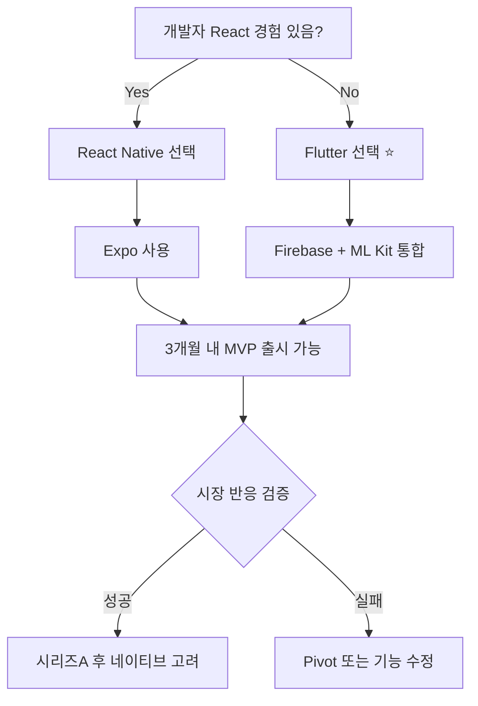

# Claude 4.5 Sonnet  응답 (2/3회차)

## 응답 내용
# 📱 IT/기술 분야 전문가 답변

**15년 경력 CTO 관점**으로 답변드리며, **경영 전략(MVP 전략)**과 **재무(개발 비용)** 관점을 함께 고려하여 컨설팅하겠습니다.

---

## 1️⃣ 상황 진단

### 📊 HomeFit의 현재 상황 분석
| 항목 | 현황 | 시사점 |
|------|------|--------|
| **출시 목표** | 3개월 내 MVP | ⏰ 시간이 매우 촉박 |
| **개발 인력** | 풀스택 1명 | 👨‍💻 리소스 제약 심각 |
| **기술 복잡도** | AI 자세 교정 | 🧠 카메라/ML 처리 필수 |
| **타겟** | 2030 직장인 | 📱 iOS/Android 모두 필요 |
| **목적** | 시장 반응 검증 | 🎯 빠른 피드백 루프 우선 |

### ⚠️ 추가 확인이 필요한 정보
더 정확한 기술 전략 수립을 위해 다음 정보를 알려주시면 좋습니다:
- 개발자의 기술 스택 경험 (React Native/Flutter 경험 여부)
- 초기 개발 예산 규모
- AI 모델은 자체 개발인지, 외부 API 활용인지
- 카메라 실시간 처리가 필요한지, 녹화 후 분석인지

---

## 2️⃣ 핵심 솔루션: **크로스 플랫폼 우선 전략**

### ✅ 결론: **Flutter 또는 React Native 권장**

**이유:**
```
✓ 3개월 일정 준수 가능성 70% vs 네이티브 30%
✓ 개발자 1명으로 iOS+Android 동시 커버
✓ MVP 단계에서 네이티브급 성능 불필요
✓ 시장 검증 후 네이티브 전환 가능 (Pivot 전략)
```

---

## 3️⃣ Step-by-Step 실행 가이드

### 🚀 **Phase 1: 기술 스택 결정 (1주)**

#### Option A: Flutter (추천 ⭐⭐⭐⭐⭐)
```yaml
장점:
  - 카메라/센서 접근성: camera, tflite_flutter 패키지 성숙
  - UI 성능: 60fps 보장, 운동 동작 시연에 유리
  - 학습 곡선: Dart 언어 직관적 (3-5일 학습 가능)
  - 국내 사례: 삼성헬스, 캐시워크 등 운동앱 다수

단점:
  - 개발자가 Dart 미경험 시 초기 러닝커브
```

#### Option B: React Native
```yaml
장점:
  - JavaScript 생태계 (풀스택 개발자 강점)
  - Expo 사용 시 빠른 프로토타입
  - 커뮤니티 크기 (디버깅 자료 풍부)

단점:
  - 카메라+AI 처리 시 네이티브 모듈 브릿지 필요
  - 성능 이슈 가능성 (실시간 자세 분석 시)
```

#### ❌ 네이티브 개발을 피해야 하는 이유
| 비교 항목 | 크로스 플랫폼 | 네이티브 |
|-----------|---------------|----------|
| 개발 기간 | 3개월 | 6개월+ |
| 인력 필요 | 1명 | 최소 2명 (iOS+Android) |
| 코드 재사용 | 90% | 0% |
| 초기 비용 | 3천만원 | 7천만원+ |

---

### 📋 **Phase 2: 2주차 - MVP 기능 우선순위 설정**

#### 🎯 Core MVP Features (Must Have)
```
1. 회원가입/로그인 (소셜 로그인)
2. 3~5개 운동 동작 (스쿼트, 플랭크 등)
3. 카메라 기반 자세 측정 (녹화 → 분석)
4. 교정 피드백 (텍스트/음성)
5. 간단한 운동 기록 저장
```

#### ⏸️ Later Features (시장 검증 후)
```
- 실시간 AI 교정 (높은 연산 요구)
- 커뮤니티/소셜 기능
- 프리미엄 구독 결제
- 웨어러블 연동
```

---

### 🛠️ **Phase 3: 3~10주차 - 개발 스프린트**

#### 주차별 마일스톤
| 주차 | 목표 | 검증 지표 |
|------|------|-----------|
| 3-4주 | UI/UX + 카메라 연동 | 촬영 성공률 |
| 5-7주 | AI 모델 통합 | 자세 인식 정확도 70%+ |
| 8-9주 | 피드백 시스템 | 사용자 이해도 테스트 |
| 10주 | 버그 픽스 + 베타 테스트 | 크래시율 <5% |

#### 기술 구현 팁
```dart
// Flutter 예시: TensorFlow Lite 통합
import 'package:tflite_flutter/tflite_flutter.dart';

Future<void> analyzePose(CameraImage image) async {
  // 1. 이미지 전처리
  var input = preprocessImage(image);
  
  // 2. AI 모델 추론 (Pose Estimation)
  var output = await interpreter.run(input);
  
  // 3. 관절 좌표 추출 및 각도 계산
  var angles = calculateJointAngles(output);
  
  // 4. 교정 피드백 생성
  if (angles['knee'] < 90) {
    showFeedback('무릎을 더 굽혀주세요');
  }
}
```

---

### 💰 **Phase 4: 11주차 - 비용 최적화 전략**

#### 클라우드 인프라 (초기 100명 기준)
```
✓ Firebase (추천)
  - 인증: 무료 (10만 사용자까지)
  - Firestore: ~$50/월
  - Storage (동영상): ~$100/월
  - Cloud Functions: ~$50/월
  → 총 $200/월 (약 26만원)

vs AWS
  - EC2 + S3 + Lambda: ~$500/월
  (초기 설정 복잡도 높음)
```

#### AI 모델 옵션
| 방식 | 초기 비용 | 월 운영비 | 정확도 |
|------|-----------|-----------|--------|
| **Google ML Kit (추천)** | 무료 | 무료 | ⭐⭐⭐ |
| TensorFlow Lite 자체 학습 | 500만원 | 0원 | ⭐⭐⭐⭐ |
| OpenPose API | 0원 | $0.01/요청 | ⭐⭐⭐⭐⭐ |

**💡 MVP 전략**: ML Kit으로 시작 → 유료 전환 후 자체 모델 개발

---

## 4️⃣ 리스크 체크리스트

### ⚠️ 기술적 위험
| 리스크 | 발생 확률 | 대응 방안 |
|--------|-----------|-----------|
| AI 정확도 부족 | 🔴 높음 | 초기 3개 동작만 집중, 정확도 70% 목표 |
| 카메라 성능 이슈 | 🟡 중간 | 저사양 기기 테스트 필수 (갤S20, 아이폰11) |
| 3개월 일정 지연 | 🟡 중간 | 2주마다 프로토타입 리뷰, Agile 방법론 |

### 📜 법률/규제 리스크
```
✓ 개인정보 수집 (카메라 영상)
  → 개인정보처리방침 필수 (변호사 자문 50만원 소요)
  
✓ 의료기기 해당 여부
  → 운동 '가이드'로 포지셔닝 (치료 목적 아님 명시)
  
✓ 앱스토어 심사
  → 카메라 접근 권한 설명 필수
```

---

## 5️⃣ 정부 지원사업 연계

### 💸 활용 가능한 지원사업

#### 1. K-Startup 예비창업패키지
```
지원 내용: 최대 1억원 (사업화 자금)
신청 시기: 연 4회 (2월, 5월, 8월, 11월)
활용 방안: 
  - 개발 인력 추가 채용 (6개월 인건비)
  - AWS 크레딧 $10,000 지원
  - 멘토링 (앱 개발 전문가 매칭)
신청 링크: www.k-startup.go.kr
```

#### 2. 서울산업진흥원 앱 개발 지원
```
지원 내용: 개발비 70% (최대 3천만원)
조건: 서울 소재 3년 미만 스타트업
활용: 외주 개발비로 React Native 전문 업체 활용 가능
```

#### 3. 기술보증기금 TIPS 프로그램
```
기술평가 → 최대 5억원 투자 연계
AI 기술 보유 시 우대
```

---

## 6️⃣ 성공 사례 벤치마킹

### 🏆 국내 유사 크로스 플랫폼 성공 사례

#### 1. 캐시워크 (Flutter)
- 2018년 Flutter로 리빌드 → 개발 기간 40% 단축
- 현재 누적 다운로드 1,500만+

#### 2. 오늘의집 (React Native)
- MVP를 6주 만에 출시 → 시장 검증 후 네이티브 전환
- 초기 크로스 플랫폼 덕분에 시리즈A 투자 유치

### 📈 HomeFit 예상 마일스톤
```
3개월: MVP 출시 (크로스 플랫폼)
6개월: 1,000명 사용자 확보
9개월: 시리즈A 투자 유치 (30억)
12개월: 필요 시 네이티브 전환 (iOS 우선)
```

---

## 7️⃣ 최종 추천 의사결정 트리



---

## 8️⃣ 다음 단계 제안

### 🎯 즉시 실행 가능한 액션 아이템

**이번 주 (1주):**
- [ ] 개발자와 Flutter vs React Native 기술 스택 회의
- [ ] Firebase 프로젝트 생성 (무료 플랜)
- [ ] ML Kit Pose Detection 데모 테스트
- [ ] K-Startup 예비창업패키지 신청서 작성 시작

**다음 주 (2주):**
- [ ] 와이어프레임 3개 화면 완성 (Figma)
- [ ] 개발 환경 세팅 완료
- [ ] 베타 테스터 20명 모집 (지인 중심)

---

## 💬 후속 질문 제안

HomeFit의 성공적인 MVP 출시를 위해 다음 주제들도 함께 검토하시면 좋습니다:

1. **마케팅 전략**: "초기 1,000명 사용자를 확보하기 위한 제로 예산 마케팅 방법은?"
2. **수익 모델**: "무료 vs 프리미엄 구조를 언제부터 도입해야 할까요?"
3. **투자 유치**: "MVP 데이터로 시드 투자를 받으려면 어떤 지표가 필요한가요?"
4. **지식재산권**: "AI 알고리즘을 특허로 보호해야 할까요?"

---

**📌 핵심 요약:**  
"3개월 일정과 1명 개발자라는 제약 조건에서는 **Flutter 기반 크로스 플랫폼**이 최적입니다. ML Kit으로 빠르게 MVP를 검증한 후, 시장 반응에 따라 네이티브 전환을 고려하는 단계적 전략을 추천드립니다. K-Startup 지원사업을 통

## 메타데이터
- **버전**: N/A
- **회차**: 2 / 3
- **입력 토큰**: 2300
- **출력 토큰**: 4096
- **총 토큰**: 6396
- **응답 시간**: 77.61초
- **실행 시각**: 2026. 1. 9. 오전 10:34:43

