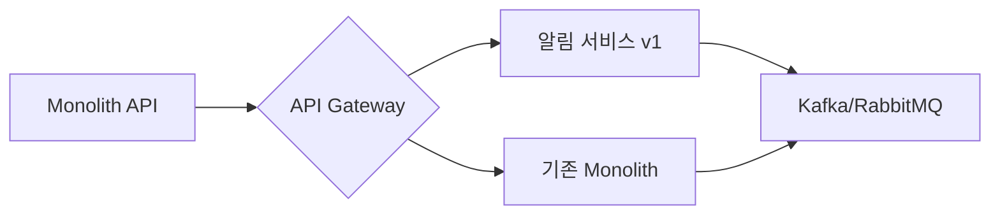

# Claude 4.5 Sonnet  응답 (3/3회차)

## 응답 내용
# [IT/기술 분야 CTO 전문가로서 답변드리겠습니다]

**올인원커머스**의 현 상황은 전형적인 '성장통'입니다. 단일 시스템이 주는 개발 편의성이 이제는 오히려 속도와 안정성을 저해하는 단계에 접어들었습니다. MSA 전환은 불가피한 선택이지만, **무리한 전환은 새로운 재난**이 될 수 있습니다.

---

## 📊 [상황 진단]

### 현재 시스템 상태 분석
- **긍정 요소**: 개발팀 25명 규모는 MSA 전환에 적정한 인력 구성
- **위험 요소**: 
  - 인프라팀 2명은 MSA 운영에 부족 (최소 4~5명 권장)
  - 데이터 일관성 경험 부족 시 Saga 패턴 적용 난이도 높음
  - 커머스 도메인 특성상 주문-결제-재고의 트랜잭션 복잡도 매우 높음

### 추가로 파악이 필요한 정보
더 정확한 로드맵 설계를 위해 다음 정보를 공유해주시면 감사하겠습니다:
1. **현재 DAU/MAU 규모 및 향후 3개월 성장률 예측**
2. **가장 빈번하게 배포되는 기능 영역** (주문/검색/추천 등)
3. **데이터베이스 구조**: 단일 RDBMS인지, 이미 일부 분리되었는지
4. **현재 평균 배포 주기** (일/주/월 단위)
5. **장애 발생 시 가장 큰 피해 도메인** (결제? 재고?)

---

## 💡 [핵심 솔루션: 3단계 점진적 MSA 전환 전략]

### ✅ **원칙: "Strangler Fig Pattern" 채택**
- 기존 시스템을 유지하면서 점진적으로 서비스를 분리
- Big Bang 방식(한 번에 전환)은 **절대 금지**

---

## 🚀 [Step-by-Step 실행 가이드]

### **Phase 1: 준비 및 기반 구축 (1~2개월)**

| 항목 | 액션 아이템 | 담당 | 산출물 |
|------|------------|------|--------|
| **도메인 분석** | DDD 워크숍 실시 (Bounded Context 정의) | 전체 개발팀 | 도메인 맵, 서비스 경계도 |
| **모니터링 체계** | APM 도입 (Datadog/New Relic/Scouter 등) | 인프라팀 | 실시간 성능 대시보드 |
| **데이터 의존성 분석** | 테이블 간 Join 패턴 분석, ERD 재작성 | 백엔드 리드 | 데이터 종속성 매트릭스 |
| **CI/CD 파이프라인** | Jenkins/GitHub Actions로 독립 배포 환경 구축 | 인프라팀 | 자동 배포 스크립트 |
| **메시지 큐 선정** | Kafka/RabbitMQ/AWS SQS 중 선택 및 PoC | 백엔드 시니어 | 이벤트 버스 프로토타입 |

#### 🎯 **핵심 결정사항**
```
Q: 어느 서비스부터 분리할 것인가?
A: 다음 우선순위로 선정
   1순위: 독립적 도메인 (예: 리뷰/알림 시스템)
   2순위: 배포 빈도 높은 기능
   3순위: 트래픽 폭증 영역 (검색/추천)
   ❌ 피해야 할 1순위: 주문-결제-재고 (복잡도 최상)
```

---

### **Phase 2: 파일럿 서비스 분리 (2~3개월)**

#### 1️⃣ **첫 MSA 후보: 알림(Notification) 서비스 권장**
**이유:**
- 비즈니스 크리티컬도 낮음 (실패해도 매출 직접 타격 없음)
- 데이터 의존성 낮음 (이메일/SMS 발송만 담당)
- 비동기 처리에 최적화

#### 2️⃣ **분리 프로세스**


#### 3️⃣ **데이터 일관성 전략 (Saga Pattern 준비)**
| 시나리오 | 패턴 | 구현 방식 |
|---------|------|----------|
| 주문 완료 → 알림 발송 | **Choreography** | 주문 서비스가 'OrderCompleted' 이벤트 발행 → 알림 서비스 구독 |
| 결제 실패 → 주문 취소 | **Orchestration** | 주문 서비스가 Saga Orchestrator 역할 수행 |

#### 🔴 **파일럿 단계 필수 체크리스트**
- [ ] 분산 추적(Distributed Tracing) 구현 (Jaeger/Zipkin)
- [ ] 장애 격리 테스트 (알림 서비스 다운 시 주문 프로세스 정상 동작?)
- [ ] Rollback 시나리오 문서화
- [ ] 성능 비교 지표 수립 (응답시간, 배포 시간 Before/After)

---

### **Phase 3: 코어 도메인 분리 (6~12개월)**

#### 🎯 **분리 우선순위 (커머스 기준)**
```
1단계: 상품 카탈로그 서비스
  - Read Heavy → CQRS 패턴 적용 검토
  - Elasticsearch 연동 (검색 최적화)

2단계: 재고 관리 서비스
  - Eventual Consistency 허용 범위 명확히 정의
  - Redis 기반 재고 캐싱 + 주기적 동기화

3단계: 주문-결제 서비스 (가장 복잡)
  - Saga Orchestration 필수
  - 2PC(Two-Phase Commit) 대신 보상 트랜잭션(Compensating Transaction) 설계
```

#### 🛡️ **Saga Pattern 구현 예시 (주문 프로세스)**

```java
// Orchestration 방식 예시
public class OrderSagaOrchestrator {
    
    @Transactional
    public void createOrder(OrderRequest request) {
        // 1. 주문 생성
        Order order = orderRepository.save(request);
        
        try {
            // 2. 재고 차감 (동기 호출)
            inventoryService.reserve(order.getItems());
            
            // 3. 결제 처리
            paymentService.processPayment(order.getPaymentInfo());
            
            // 4. 성공 이벤트 발행
            eventPublisher.publish(new OrderCompletedEvent(order));
            
        } catch (InsufficientStockException e) {
            // 보상 트랜잭션: 주문 취소
            orderRepository.updateStatus(order.getId(), CANCELLED);
            throw new OrderFailedException("재고 부족");
            
        } catch (PaymentFailedException e) {
            // 보상 트랜잭션: 재고 복구 + 주문 취소
            inventoryService.release(order.getItems());
            orderRepository.updateStatus(order.getId(), CANCELLED);
            throw new OrderFailedException("결제 실패");
        }
    }
}
```

#### 📊 **데이터 일관성 레벨 정의 (필수)**
| 도메인 | 일관성 요구사항 | 허용 지연 시간 |
|--------|---------------|--------------|
| 결제 | **Strong Consistency** | 0초 (즉시) |
| 재고 | Eventual Consistency | 1~3초 |
| 추천 | Eventual Consistency | 10분 |
| 리뷰 | Eventual Consistency | 1시간 |

---

## ⚠️ [리스크 체크리스트]

### 🔴 **치명적 실수 TOP 5**
1. **네트워크 장애 시나리오 미고려**
   - 해결: Circuit Breaker 패턴 필수 (Hystrix/Resilience4j)
   
2. **분산 트랜잭션 롤백 미설계**
   - 해결: 모든 외부 호출에 타임아웃 + 재시도 + 보상 로직 구현
   
3. **API Gateway 단일 장애점(SPOF) 방치**
   - 해결: 다중화 + Health Check 엔드포인트 필수
   
4. **로그 추적 불가능**
   - 해결: Correlation ID를 모든 서비스에 전파
   
5. **데이터베이스 분리 시 외래키 제약 무시**
   - 해결: 애플리케이션 레벨에서 참조 무결성 검증 로직 추가

### 💰 **예상 추가 비용 (연간)**
- 인프라 비용 증가: 기존 대비 **30~50%** (컨테이너 오케스트레이션)
- 모니터링 도구: 연 **1,500만원~3,000만원** (APM 라이선스)
- 추가 인력: 인프라 2명 → **최소 4명**으로 증원 필요 (연 **1억 2천만원**)

---

## 📌 [정부 지원 사업 연계]

| 사업명 | 지원 내용 | 신청 시기 | 주관 기관 |
|--------|----------|-----------|----------|
| **클라우드 바우처** | 클라우드 이용료 최대 1억원 지원 | 상시 | 정보통신산업진흥원 |
| **AI·빅데이터 플랫폼 및 센터 구축 지원** | MSA 전환 컨설팅 + 인프라 | 2~3월 | 과기정통부 |
| **기업 주도형 기술개발** | R&D 자금 최대 10억원 | 1~2월 | 중기부 |

📞 **문의**: K-Startup (1357), 기업마당 (www.bizinfo.go.kr)

---

## 🔄 [후속 질문 제안]

올인원커머스의 성공적인 MSA 전환을 위해 다음 주제를 함께 검토하시면 좋습니다:

1. **"현재 데이터베이스가 PostgreSQL/MySQL 등 어떤 구조인지, 샤딩 경험이 있는지?"**
   → 데이터베이스 분리 전략이 달라집니다.

2. **"Kubernetes 경험이 있는 인력이 있는지?"**
   → 없다면 AWS ECS/Fargate 같은 관리형 서비스 우선 추천

3. **"레거시 코드의 테스트 커버리지가 몇 %인가요?"**
   → 50% 미만이면 리팩토링 선행 필수

4. **"Black Friday 같은 트래픽 폭증 이벤트가 있나요?"**
   → Auto Scaling 설정 및 부하 테스트 전략 필요

---

### 🎓 **추천 학습 자료**
- 도서: "마이크로서비스 패턴" (크리스 리처드슨 저)
- 강의: "MSA 구축 가이드" (인프런/패스트캠퍼스)
- 레퍼런스: 우아한형제들 기술 블로그 (배민 MSA 전환기)

---

**"기술은 목적이 아니라 수단입니다."** MSA 전환이 비즈니스 목표(빠른 배포, 서비스 안정성)에 실질적으로 기여하는지 각 단계마다 측정 지표를 명확히 하시기 바랍니다. 추가 상담이 필요하시면 언제든지 질문 주세요! 💪

## 메타데이터
- **버전**: N/A
- **회차**: 3 / 3
- **입력 토큰**: 2373
- **출력 토큰**: 3802
- **총 토큰**: 6175
- **응답 시간**: 70.75초
- **실행 시각**: 2026. 1. 9. 오전 10:35:25

