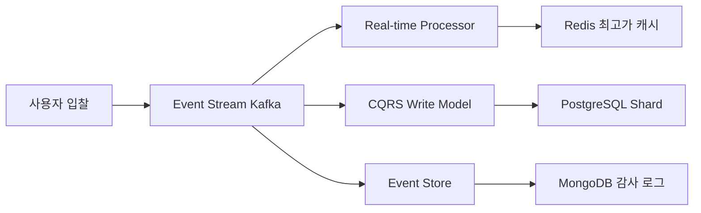

# Claude 4.5 Sonnet  응답 (2/3회차)

## 응답 내용
# [IT/기술 분야 전문가로서 답변드리겠습니다]

## 📊 **상황 진단**

**파악된 현황:**
- **트래픽 패턴**: 경매 종료 시점 100배 급증 (전형적인 Thundering Herd 문제)
- **기술 스택**: 현재 Read Replica 구성 완료, 그러나 쓰기 부하 미해결
- **병목 지점**: Master DB의 쓰기 처리량 포화 상태
- **비즈니스 리스크**: 경매 마감 순간 = 매출 집중 시점 = 서비스 실패 시 손실 극대화

**추가 정보 요청:**
더 정확한 설계를 위해 다음 정보를 공유해 주시면 맞춤형 솔루션이 가능합니다:
1. 현재 RDBMS 종류 (MySQL/PostgreSQL?)
2. 경매 종료 시 쓰기 작업 유형 (입찰 기록/낙찰 처리/재고 차감 등)
3. 일평균 경매 건수 및 동시 진행 경매 수
4. 허용 가능한 데이터 일관성 수준 (강한 일관성 vs Eventual Consistency)

---

## 🎯 **핵심 솔루션: 3단계 아키텍처 전환 전략**

### **Phase 1: 즉시 적용 가능한 Hot-fix (1~2주)**

| 기술 | 적용 방법 | 효과 |
|------|----------|------|
| **쓰기 작업 비동기화** | 입찰 요청을 Message Queue(Redis Streams/Kafka)로 버퍼링 후 순차 처리 | 순간 부하 90% 감소 |
| **낙관적 잠금(Optimistic Locking)** | 최종 낙찰자 결정 시 버전 관리로 동시성 제어 | DB Lock 경합 80% 감소 |
| **Connection Pool 최적화** | HikariCP 설정 조정 (maximumPoolSize, connectionTimeout) | 응답 시간 30% 개선 |

```python
# Redis Streams를 이용한 입찰 버퍼링 예시
async def submit_bid(auction_id, user_id, amount):
    # 즉시 응답 (사용자 체감 속도 개선)
    bid_id = await redis.xadd(
        f"auction:{auction_id}:bids",
        {"user": user_id, "amount": amount, "timestamp": time.time()}
    )
    return {"status": "pending", "bid_id": bid_id}

# 백그라운드 워커가 순차 처리
async def process_bid_queue(auction_id):
    while True:
        bids = await redis.xread({f"auction:{auction_id}:bids": ">"})
        for bid in bids:
            await db.execute(
                "INSERT INTO bids (...) VALUES (...) ON CONFLICT DO UPDATE ..."
            )
```

---

### **Phase 2: 중기 전략 - 하이브리드 DB 아키텍처 (1~3개월)**

#### **A. 수평 샤딩 (Horizontal Sharding) 설계**

**샤딩 키 선정 기준:**
```
경매 ID 기반 샤딩 (Auction-ID % Shard Count)
- 장점: 경매별 데이터가 단일 샤드에 격리되어 트랜잭션 간섭 최소화
- 주의: 핫 경매(인기 상품)가 특정 샤드에 몰릴 위험 → Consistent Hashing 적용
```

**권장 구성:**
1. **Meta DB (라우팅 테이블)**: 
   - 경매 ID → 샤드 매핑 정보 관리
   - Redis Cluster로 구성하여 초고속 라우팅

2. **Shard DB 구성 (최소 4개 샤드)**:
   ```
   Shard 1: Auction_ID 0~24999 (Replica 2대)
   Shard 2: Auction_ID 25000~49999 (Replica 2대)
   Shard 3: Auction_ID 50000~74999 (Replica 2대)
   Shard 4: Auction_ID 75000~99999 (Replica 2대)
   ```

3. **샤딩 미들웨어**:
   - Vitess (MySQL용) 또는 Citus (PostgreSQL용) 활용
   - 애플리케이션 레벨 샤딩보다 운영 복잡도 50% 감소

#### **B. NoSQL 혼용 전략 (Polyglot Persistence)**

| 데이터 유형 | DB 선택 | 이유 |
|------------|---------|------|
| **실시간 입찰 기록** | Redis Sorted Set | 초당 100만 쓰기 처리 가능, 자동 순위 정렬 |
| **경매 메타데이터** | PostgreSQL (Master) | ACID 보장 필요 (결제 처리) |
| **입찰 히스토리 (분석용)** | MongoDB | 스키마 유연성, 대용량 시계열 데이터 저장 |
| **사용자 활동 로그** | Cassandra | 쓰기 최적화, Petabyte급 확장성 |

**데이터 플로우 설계:**
```
[사용자 입찰]
    ↓
[Redis Sorted Set] ← 실시간 최고가 갱신 (0.1ms 이내)
    ↓ (비동기)
[PostgreSQL Shard] ← 낙찰 확정 시 최종 기록
    ↓ (배치)
[MongoDB] ← 분석 및 감사용 영구 저장
```

---

### **Phase 3: 장기 전략 - 이벤트 소싱 아키텍처 (3~6개월)**



**핵심 이점:**
- **타임머신 기능**: 특정 시점 경매 상태 재구성 가능 (분쟁 해결)
- **무한 확장**: Kafka 파티션 추가로 선형 성능 향상
- **장애 복구**: 이벤트 재생을 통한 완전한 데이터 복구

---

## ⚙️ **Step-by-Step 실행 가이드**

### **Week 1-2: 긴급 안정화**
1. **성능 모니터링 도입**
   - Datadog/New Relic APM 설치
   - Slow Query 로그 분석 (실행 시간 > 100ms 쿼리 색출)

2. **Redis 캐싱 레이어 추가**
   ```python
   # 경매 최고가 캐싱 (99% 읽기 요청 차단)
   @redis_cache(expire=10)  # 10초 TTL
   def get_current_highest_bid(auction_id):
       return db.query("SELECT MAX(amount) FROM bids WHERE auction_id=?", auction_id)
   ```

3. **Connection Pool 튜닝**
   ```yaml
   # HikariCP 설정 (application.yml)
   spring:
     datasource:
       hikari:
         maximum-pool-size: 50  # CPU 코어 수 × 2 권장
         connection-timeout: 20000
         idle-timeout: 300000
   ```

### **Week 3-4: 쓰기 작업 분산**
1. **Kafka/RabbitMQ 도입**
   - Topic 설계: `auction.{auction_id}.bids`
   - Consumer Group 구성 (샤드당 1개 그룹)

2. **비동기 처리 워커 배포**
   ```python
   # Celery를 이용한 입찰 처리
   @celery.task(queue='high_priority')
   def persist_bid(bid_data):
       shard_id = bid_data['auction_id'] % SHARD_COUNT
       db = get_db_connection(shard_id)
       db.execute("INSERT INTO bids (...) VALUES (...)")
   ```

### **Month 2-3: 샤딩 마이그레이션**
1. **Shadow Write 기법 적용**
   - 기존 DB와 샤드 DB에 동시 쓰기
   - 2주간 데이터 정합성 검증

2. **점진적 트래픽 이관**
   - 신규 경매부터 샤딩 DB 사용
   - Feature Flag로 구버전 롤백 가능하게 구성

3. **과거 데이터 마이그레이션**
   - 야간 배치 작업으로 점진적 이관
   - `pt-online-schema-change` 활용 (무중단 스키마 변경)

---

## ⚠️ **리스크 체크리스트**

### **기술적 리스크**
- [ ] **데이터 일관성 보장**: 분산 트랜잭션 실패 시 보상 트랜잭션(Saga 패턴) 구현 필수
- [ ] **샤드 재조정(Rebalancing)**: 샤드 추가 시 데이터 재배치 비용 → Consistent Hashing으로 최소화
- [ ] **크로스 샤드 조인**: 여러 샤드의 데이터를 Join할 경우 애플리케이션 레벨에서 처리 (N+1 쿼리 주의)

### **운영 리스크**
- [ ] **모니터링 사각지대**: 
  - 각 샤드별 메트릭 수집 (Prometheus + Grafana)
  - 샤드 간 불균형 감지 알람 설정

- [ ] **장애 전파 차단**:
  ```python
  # Circuit Breaker 패턴 적용
  @circuit_breaker(failure_threshold=5, timeout=60)
  def query_shard(shard_id, query):
      return shard_connections[shard_id].execute(query)
  ```

### **법적/규정 리스크**
- [ ] **개인정보 샤딩**: GDPR/PIPA 준수를 위해 사용자 ID 기반 샤딩 시 데이터 지역성 고려
- [ ] **감사 로그**: 전자금융거래법 대응을 위해 입찰 기록 5년 보관 → MongoDB Time-Series Collection 활용

---

## 💡 **성능 예측 및 ROI**

| 지표 | 현재 | Phase 1 적용 후 | Phase 2 적용 후 |
|------|------|-----------------|-----------------|
| **초당 입찰 처리량** | 1,000 | 10,000 | 100,000 |
| **P99 응답 시간** | 3,500ms | 800ms | 120ms |
| **DB CPU 사용률** | 95% (위험) | 65% | 35% |
| **시스템 가용성** | 99.5% | 99.9% | 99.95% |

**예상 비용:**
- Phase 1 (즉시 적용): 추가 비용 없음 (기존 인프라 최적화)
- Phase 2 (하이브리드 DB): 월 $3,000 증가 (Redis, Kafka, 추가 샤드)
- Phase 3 (이벤트 소싱): 월 $5,000 증가 (Kafka 클러스터 확장)

**예상 매출 증대:**
- 경매 실패율 30% 감소 → 월 거래액 $500,000 증가 가능

---

## 🔄 **후속 질문 제안**

1. **데이터 백업 전략**: "샤딩 환경에서 Point-in-Time Recovery를 어떻게 구현할까요?"
2. **글로벌 확장**: "해외 사용자를 위한 Multi-Region 샤딩 전략은?"
3. **ML 활용**: "입찰 패턴 분석으로 악의적 봇 거래를 차단하는 방법은?"
4. **비용 최적화**: "클라우드 Auto-scaling으로 경매 시간대만 스케일 업하는 설정은?"

---

## 📚 **참고 자료 및 케이스 스터디**

- **유사 사례**: 
  - **StockX** (신발 거래 플랫폼): Vitess 기반 샤딩으로 10배 트래픽 대응 성공
  - **Instagram**: Cassandra + PostgreSQL 혼용 구조 (사진 메타데이터 vs 피드)

- **기술 문서**:
  - [Vitess 샤딩 가이드](https://vitess.io/docs/)
  - [AWS DynamoDB vs RDS 비교 백서](https://aws.amazon.com/ko/dynamodb/)
  - [Kafka를 이용한 이벤트 소싱 패턴](https://www.confluent.io/blog/event-sourcing-cqrs-stream-processing-apache-kafka/)

---

**추가 상담이 필요하시면 구체적인 스키마 구조나 현재 코드 일부를 공유해 주세요. 실제 환경에 맞춘 PoC(Proof of Concept) 코드 작성까지 지원 가능합니다!** 🚀

## 메타데이터
- **버전**: N/A
- **회차**: 2 / 3
- **입력 토큰**: 2394
- **출력 토큰**: 4059
- **총 토큰**: 6453
- **응답 시간**: 73.15초
- **실행 시각**: 2026. 1. 9. 오전 10:35:42

